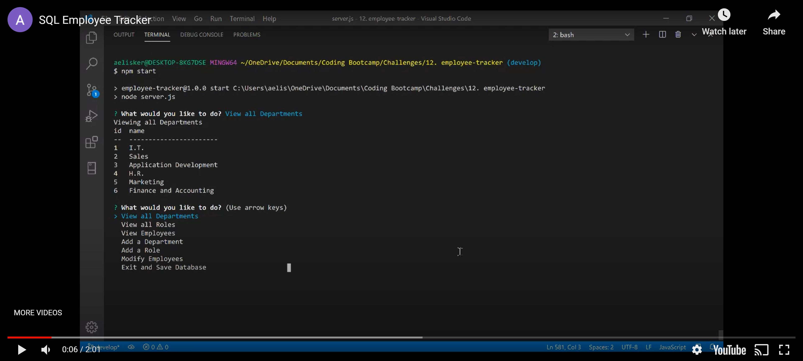

# Employee Tracker 

## Description
This application can be used to track and modify employees for a company. A SQL database is used to store relational information.

## Table of Contents
* [Installation](#Installation)
  
* [Usage](#Usage)

* [License](#License)

* [Questions](#Questions)

## Installation
Installation instructions listed below:
```
npm init -y
npm install
```
  
## Usage
Create a file named .env in the parent directory for server.js with the line DB_PW = 'YOUR_PASSWORD' where YOUR_PASSWORD is your MySql password. Ensure everything in db/db.js is accurate to your MySql information. After running npm install, run 'npm start' from server.js' parent directory to start the application. From there, use the command line to interact with the program.
[](https://www.youtube.com/embed/-CrAGV0Rnws)

## License
A short and simple permissive license with conditions only requiring preservation of copyright and license notices. Licensed works, modifications, and larger works may be distributed under different terms and without source code.

To view the full license, [click here](./src/license/MIT.txt).

## Questions
If you have any questions, you can find me at [aelisker](https://github.com/aelisker) and via email at [alisker@protonmail.com](mailto:alisker@protonmail.com).
    